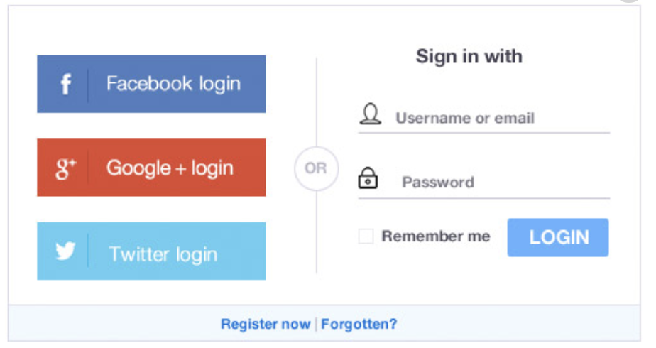
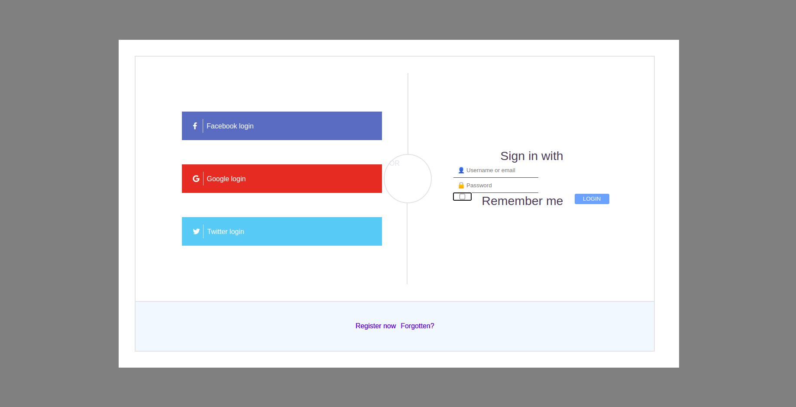

# Login

## My first attempt to create a copy of a login page using HTML and CSS.

This is the given Login page example.

#### This is my take on the login page and you can see it by clicking on the image down here.

